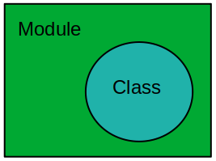

# Ruby in Depth 
Ruby is dynamic, open-source programming language with a focus on simplicity and productivity. It is more like human-readable language. 
Below we're going to discuss some concepts related to ruby.

## Module
A class is a collection of methods, variables, and constants.
A module is somewhat similar to a Class, but we are not allowed to create objects of a module, modules can't be inherited, A class can be implemented inside a module.

A module can be used as a namespace and It prevents name clashes. Module provides mixin that helps to achieve multiple inheritances means we can share methods from multiple modules to multiple classes.

So we can say every class is a module, but none of the modules is a class.



#### Defining Module
We use ***module*** keyword to create a module in ruby. i.e.
```syntax
module Module_name
    #code body
end
```

#### Example
```ruby
module First_Module     #module
    def sayHello        #method under module
        puts "Hello, World!!!"
    end
end

# access Module methods
include First_Module

#method call
First_Module.sayHello

# => Hello, World!!!
```
### How to use Class, Method, Constant from Module?

We have to include modules in our code snippet to access the contents of modules. We use ***include*** keyword to do the same.
As an example is explained above, we'll discuss more examples below and try to understand the different ways to access different methods, classes, constants of modules. 

Let take an example over here.
```ruby
module PowerBank    #module
    count = 1   #constant

    def brandName(brand)    #method
        puts "Brand name is #{brand}"
    end

    class Properties    #class
        attr_accessor :usbPorts, :chargingPortType,:outputPower
        def display     #class method
            puts usbPorts
            puts chargingPortType
            puts outputPower
        end
    end
end
```
Now we have a module that has a constant, a method, and a class, let say we have saved this module file as "PowerBank.rb".

##### Syntax to access chunks from a module.
###### Access Constant
```syntax
Module_Name::Constant_Name
```

###### Access and create Class Object
```syntax
object_name = Module_Name::Class_Name.new
```

###### Access Methods
```syntax
Module_Name.Method_Name
```

###### Pass Constants in Method
```syntax
Module_Name.Method_Name(Module_Name::Constant_Name)
```

Let's discuss how we use this module to any other program/file.
let say we have created another file ****useModule.rb**** which requires these chunks from the above modules. To do that we first have to import ****PowerBank.rb**** file in our newly created program file. 
We use ***require*** keyword to import any file in ruby. Let's understand this with code.

```ruby
require "./PowerBank.rb"    #import module file

include PowerBank   #include module to access methods, classes and

#access constant
puts PowerBank::Count

#access method
puts PowerBank.brandName("mi")

#access and create class object
object = PowerBank::Properties.new

#intializing values to data members
object.usbPorts = 2
object.chargingPortType = "C"
object.outputPower = "18W"

#access class method
object.Display
```

From the above example, we get an idea about how to access Class, Constant, Method from a module. we use the scope resolution operator ****(::)**** to access Constants and Classes.

#### Include or Extend
We have discussed all the basic concepts about the module so far. Let's discuss more like when to include/extend module in classes and how mixin works, but first let's create some example modules which is going to help us to understand these concepts well.

```ruby
module Hello        #module
    def sayHello    #method
        puts "Hello, World!!!"
    end
end

class IncludeModule #class which includes module
    include Hello
end

class ExtendModule  #class which extends module
    extend Hello
end

#instance is created to call method from module
IncludeModule.new.sayHello

#no need of instances, can call method directly
ExtendModule.sayHello
```
###### Include
If we import a module with ***include*** keyword then the module will be imported to the instances, we've to create an object before accessing the method from a module.

###### Extend
If we import a module with ***extend*** keyword then the module will be imported to the class, we don't have to create an object to access them.

## Mixin
Ruby allows single inheritance only we can not do multiple inheritances directly, this might lead us to trouble if any class requires properties from multiple classes to overcome issue mixin comes to the picture.
Any class can import any number of modules, mixin helps us to share multiple methods from multiple modules to any class.

Let's understand this with an example of dualBoot scenario: in dualBoot we have a grub(Class) that requires some boot packages from windows(Module1) and ubuntu(Module2).

```ruby
module Windows      #module1
    def winBootPackage  #method in module1
        put "This is windows"
    end
end

module Ubuntu       #module2
    def ubuntuBootPackage   #method in module2
        put "This is ubuntu"
    end
end

class Grub      #class to include both modules
    include Windows     #module1 included
    include Ubuntu      #module2 included
end

grub = Grub.new     #class object

#module1 method call
grub.winBootPackage

#module2 method call
grub.ubuntuBootPackage
```
The Above example explains how module mixin helps us to import properties from two different modules in a class.


## Block, Procs and Lambda

### Block
A block is a chunk of statements written inside braces {}. They are associated with a method call having the same naming as the block does.
The statements are written inside {} can be called from the method by using keyword ***yield***.

#### Defining Block
```ruby
def myBlock     #block method
    #code body
end
myBlock{ #may have code body}   #block associated with method call
```
here we've defined a block that is associated with a method call, let's understand this with an example code.

```ruby
def myBlock 
    puts "Hi there!, it's me, block method"
    yield
end

myBlock{
    puts "Hi there!, it's me, The block"
}

# => Hi there!, it's me, block method
# => Hi there!, it's me, The block'
```

here we've written a chunk of code to understand blocks better, when we run the above code initially myBlock method will be called.
If the control flow encountered with the ***yield*** keyword, it will move to the statements present inside {}.
We can pass any number of arguments to the statements written inside {}. 


### Procs
Procs are similar to blocks but there some differences as blocks in ruby are not objects, proc can turn these blocks into objects by wrapping them in its instances.
Proc made it possible to perform all the operations related to objects on the block.
Procs are executed by calling the .call method.

#### Defining Proc
```Syntax
Proc_Name = Proc.new{ code body} 

Proc_name.call
```
Here we've defined a proc that is created with ***.new*** method, we can see it turned a block in an object.

```ruby
#create proc with .new method
myProc = Proc.new{
    puts "Hi there!, it's me, Proc"
}

#call proc method
myProc.call

# => "Hi there!, it's me, Proc'"

```

### Lambda
Lambda and proc are almost similar, the difference arises with some ****control flow keyword**** (Return, Break), even proc object can be created with kernel lambda as well.

#### Defining lambda
```Syntax
lambda_name = lambda {code body}

#another way to create lambda
lambda_name = -> {code body}
```

Above we've defined lambda in two ways. There are many ways to call lambda to let's understand them with an example code. 

```ruby
#lambda created
myLambda = -> {puts "Hi there!, it's me, lambda"}

#call lambda 
myLambda.call

myLambda.()

myLambda[]

myLambda.===

#output
# => Hi there!, it's me, lambda
# => Hi there!, it's me, lambda
# => Hi there!, it's me, lambda
# => Hi there!, it's me, lambda

```
Here we've discussed four ways to call lambda.
Let's discuss some differences between lambda and proc.

### Difference between lambda and proc
The main difference arises with some control flow keywords, let's understand these differences with some example codes.

##### Return statement
Return is a keyword that changes the control flow, we also use return statement to get some values from a method or a block of code.

###### Proc
```ruby
def myMethod    #method
    puts "Before proc block"

    myProc = Proc.new{  #proc block
        puts "Inside Proc block"
        return          #return statement
        puts "After return statement"
    }

    myProc.call     #proc call

    puts "After proc block"
end

myMethod    #method call

#output
# => Before proc block
# => Inside Proc block
```
Here we've used a return statement inside proc block, that return statement changes the control flow from proc to outside of the method.

###### lambda
```ruby
def myMethod    #method
    puts "Before lambda block"

    mylambda = ->{  #lambda block
        puts "Inside lambda block"
        return      #return statement
        puts "After return statement"
    }

    mylambda.===    #lambda call

    puts "After lambda block"
end

myMethod    #method call

#output
# => Before lambda block
# => Inside lambda block
# => After lambda block
```
In the case of lambda, return statement just changes the control flow from the lambda block to the method.


##### Break statement
Break keyword is used to break/stop the flow of an iterator.

###### Proc
```ruby
def myMethod    #method
    puts "Before proc block"

    myProc = Proc.new{      #proc block 
        puts "Inside Proc block"
        break     #break statement
        puts "After return statement"
    }

    myProc.call     #proc call

    puts "After proc block"
end

myMethod    #method call

#output
# => Before proc block
# => Inside Proc block
# => (Local Jump Error)
```
Here we've got an error(LocalJumpError) after the break statement, because we use break statement in the case of iterators, and this is a proc block.

###### lambda
```ruby
def myMethod    #method
    puts "Before lambda block"

    mylambda = ->{  #lambda block
        puts "Inside lambda block"
        break   #break statement
        puts "After return statement"
    }

    mylambda.===    #lambda call

    puts "After lambda block"
end

myMethod    #method call

#output
# => Before lambda block
# => Inside lambda block
# => After lambda block
```

In the case of lambda, we get the same output for the return and break statement, because in lambda the break and return statements are treated similarly.

We've discussed basic concepts about module, mixin, block, proc, lambda, and the difference between them, that's all for now.

## Refrences 
[GeeksforGeeks](https://www.geeksforgeeks.org/ruby-tutorial/)

 
[Ruby Tutorials by Smartherd](https://www.youtube.com/playlist?list=PLlxmoA0rQ-Lx45j3D6da7-Iqvo5wtjKBm)
